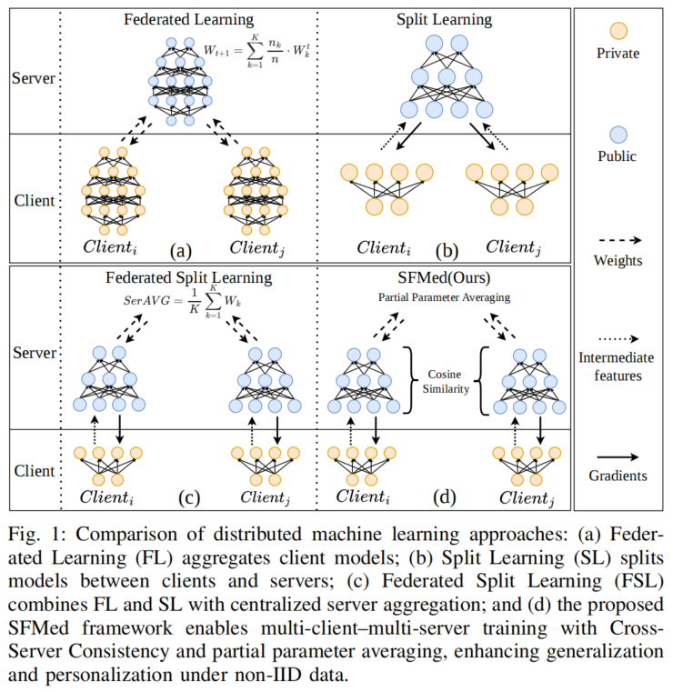
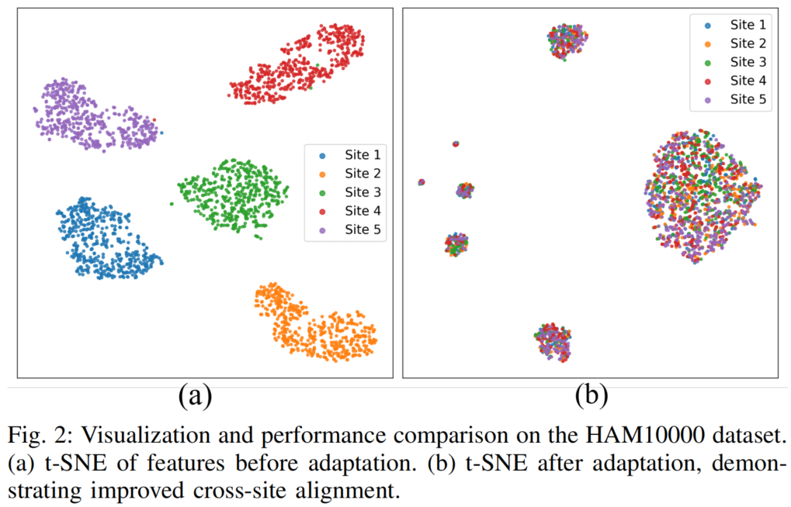
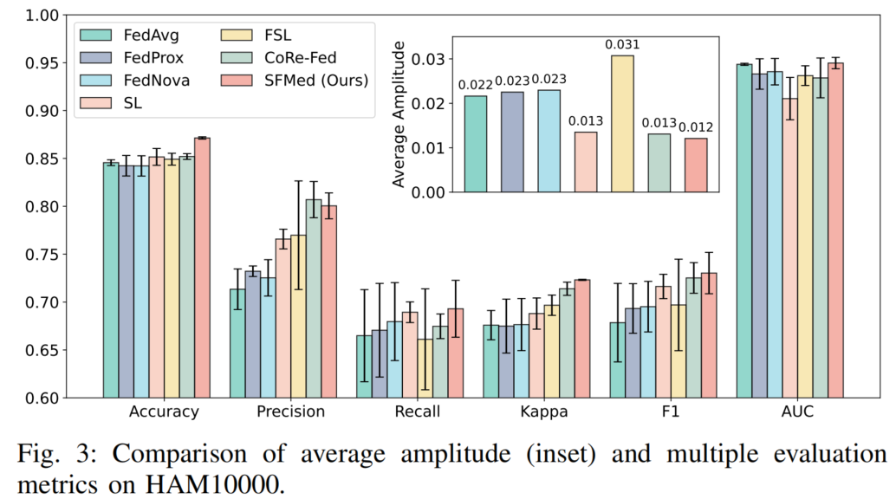
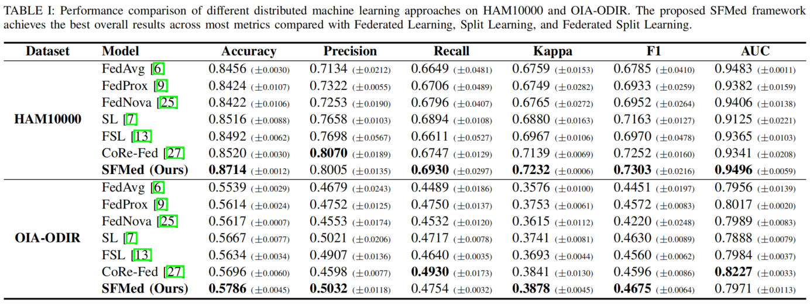
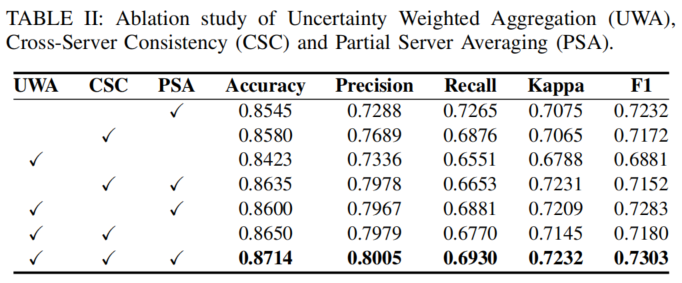
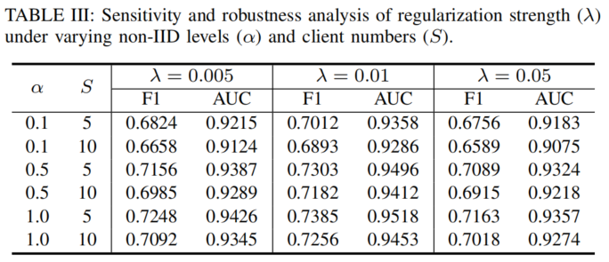

---

# 🩺 SFMed: Robust Split Federated Learning with Adaptive Aggregation for Medical Image Classification

## 📝 Project Overview

This project implements several Federated Learning algorithms (FedAvg, FedProx) and Split Learning (SFMed), supporting multi-site medical image classification tasks. It is built on PyTorch and designed for datasets such as HAM10000 and ODIR. The framework enables multi-client collaborative training, adaptive aggregation, label smoothing, rich evaluation metrics, and feature visualization.

### Framework and Results








## 📁 Directory Structure

```
SFMed/
│
├── config.yaml                # Configuration file (training parameters, paths, etc.)
├── FedAVG.py                  # Script for FedAvg federated averaging
├── FedProx.py                 # Script for FedProx federated regularization
├── SFMed.py                   # Script for SplitFedMed (split learning with adaptive aggregation)
├── SL.py                      # Script for standard split learning
├── load_dataset.py             # Dataset loading and preprocessing
├── logger.py                   # Logging utility
├── metrics.py                  # Evaluation metrics
├── model.py                    # Model definitions (e.g., ResNet50)
├── utils.py                    # Utility functions (e.g., label smoothing loss)
├── data/                       # Data directory (user-prepared)
└── ...
```

## 🚀 Key Features

* **Federated Learning Algorithms**: FedAvg, FedProx
* **Split Learning Algorithms**: Multi-client/server split training with adaptive aggregation
* **Multi-dataset Support**: HAM10000, ODIR, MNIST, Fashion-MNIST, CIFAR-10
* **Label Smoothing**: For both multi-class and multi-label classification
* **Rich Evaluation Metrics**: Kappa, F1, AUC, Accuracy, Precision, Recall, Confusion Matrix
* **Feature Visualization**: t-SNE/PCA for cross-site feature distribution
* **Logging & Result Saving**: Automatic logging and export of results

## 🛠️ Environment Requirements

* Python 3.7+
* PyTorch ≥ 1.10
* torchvision
* scikit-learn
* pandas
* numpy
* matplotlib
* pyyaml
* fedlab (for data partitioning)
* openpyxl (for Excel result export)

Install dependencies:

```sh
pip install torch torchvision scikit-learn pandas numpy matplotlib pyyaml fedlab openpyxl
```

## 📦 Data Preparation

1. **HAM10000**

   * Download the [HAM10000 dataset](https://www.kaggle.com/datasets/kmader/skin-cancer-mnist-ham10000)
   * Set the image and `metadata.csv` paths in `config.yaml` under `ham10000_image_root` and `metadata_path`

2. **ODIR**

   * Download the [ODIR dataset](https://odir2019.grand-challenge.org/dataset/)
   * Organize images into subfolders by class
   * Set `train_image_root` and `test_image_root` in `config.yaml`

3. **Other datasets** (MNIST, CIFAR-10) will be downloaded automatically

## ⚡ Quick Start

### 1. Configure Parameters

Edit `config.yaml` to set dataset paths, training parameters, number of clients, etc.

### 2. Run Federated Learning (FedAvg)

```sh
python FedAVG.py
```

### 3. Run Federated Proximal (FedProx)

```sh
python FedProx.py
```

### 4. Run Standard Split Learning

```sh
python SL.py
```

### 5. Run Adaptive Split Federated Learning (SFMed)

```sh
python SFMed.py
```

### 6. Check Logs & Results

* Log file: `log/log.txt` 📄
* Results: Excel files in the `results/` directory 📊

## 🧩 Main Modules

* `model.py`: Defines full and split models (e.g., ResNet50 for client/server)
* `metrics.py`: Implements evaluation metrics for multi-class and multi-label tasks
* `utils.py`: Includes label smoothing and other utilities
* `load_dataset.py`: Handles dataset loading, partitioning, and preprocessing
* `logger.py`: Provides timestamped logging functionality

## 🙏 Acknowledgements

* [PyTorch](https://pytorch.org/) 🐍
* [FedLab](https://fedlab.readthedocs.io/) 🤝
* [HAM10000](https://www.kaggle.com/datasets/kmader/skin-cancer-mnist-ham10000) 🖼️
* [ODIR2019](https://odir2019.grand-challenge.org/) 👁️
